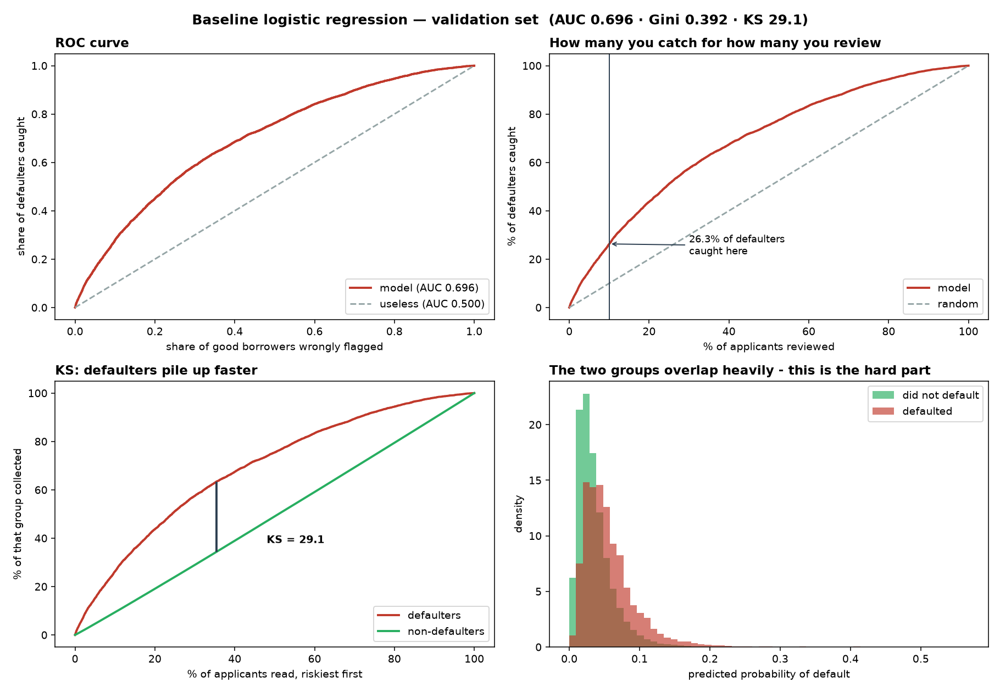
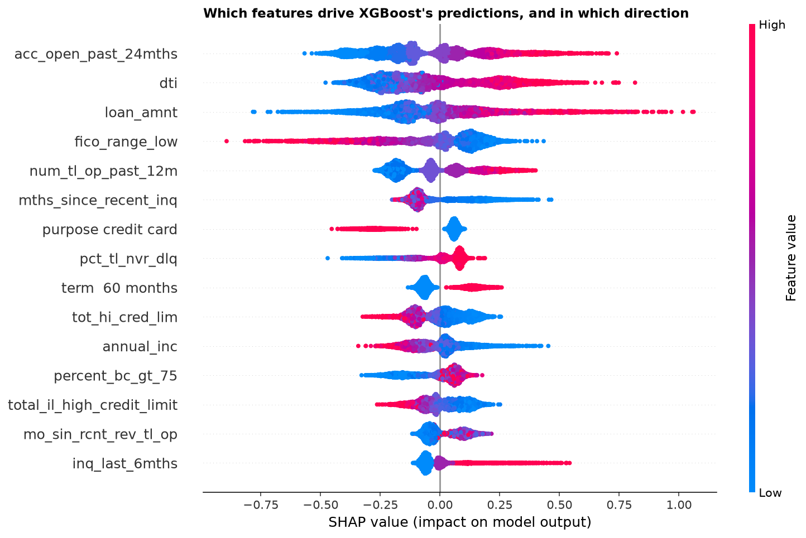

# PD Application Scorecard

A probability-of-default model for consumer loan applications, built end to end on
Lending Club data: 855,502 loans originated in 2015–2016, using only information a
lender would hold **on the day of application**.

The decision it supports is deliberately narrow. A review team cannot examine every
application, so the model ranks applicants by risk and the riskiest **10%** are routed
to manual review. Everything below follows from that one decision.

> **Headline (sealed test set, 171,101 applications)**
> Gini **0.383** · ROC-AUC **0.692** · KS **27.5**
> At 10% review capacity: **1,663 of 6,326** defaulters caught — **26.3%**, or **2.63×** random.

---

## Contents

1. [The question](#the-question)
2. [Data and cohort](#data-and-cohort)
3. [The label, and the assumption I measured instead of trusting](#the-label)
4. [What was excluded, and why](#what-was-excluded-and-why)
5. [The model](#the-model)
6. [Results](#results)
7. [Tested and rejected](#tested-and-rejected)
8. [Responsible use](#responsible-use)
9. [Limitations](#limitations)
10. [How to run it](#how-to-run-it)

---

## The question

Given only what is known when someone applies, can we rank applicants by their chance of
defaulting within twelve months, well enough that a limited review team looks at the
right ones?

Not "can we predict default" — ranking, at a stated capacity, is the thing a lender can
actually act on.

## Data and cohort

| | |
|---|---:|
| Source | `accepted_2007_to_2018Q4.csv` (151 columns) |
| Cohort | originated 2015–2016 |
| Applications | 855,502 |
| Default rate | 3.70% |
| Snapshot date | April 2019 |

The 2015–2016 window is not arbitrary. The file was snapshotted in April 2019, so even
the last loan in the cohort has had its full twelve months play out. A later cohort would
contain loans whose outcome had not yet happened, which would silently label them
"did not default".

At 3.70%, there are roughly **26 non-defaulters for every defaulter**. Every modelling
and evaluation choice in this project is downstream of that imbalance.

**Split** (`src/03_split.py`) — stratified, fixed seed, and asserted to lose or duplicate
no rows:

| Pile | Rows | Default rate |
|---|---:|---:|
| train | 513,300 | 3.70% |
| validation | 171,101 | 3.70% |
| test (sealed until stage 13) | 171,101 | 3.70% |

## The label

The dataset gives one final status per loan, not a month-by-month payment history. So
"90 days past due within twelve months" is **not directly observable** — it has to be
reconstructed from the last payment date, and that requires assuming a lag between a
borrower missing a payment and hitting 90 days delinquent.

I assumed three months. Rather than leave it there, `src/02_measure_lag.py` measures it
against loans that were still delinquent at the snapshot, whose status records how far
behind they were.

**The measured lag was four months, not three.** Correcting it moved the cohort default
rate from a plausible range of 4.4–6.5% down to **3.70%**. Sensitivity at cutoffs of 9
and 12 months is reported alongside.

This is the part of the project I would defend hardest. The assumption was mine, it was
wrong, and the data could tell me so.

## What was excluded, and why

151 raw columns → **60 features**. One rule: *would the lender know this on the day of
the application?*

| Reason | Dropped | Example |
|---|---:|---|
| Post-origination leakage | 39 | `total_pymnt`, `last_pymnt_d`, `recoveries` |
| Joint-application sparsity | 16 | `annual_inc_joint` and family |
| Time-varying availability | 14 | the December-2015 collection cliff |
| Non-predictive / identifiers | 9 | `id`, `url` |
| **Lender judgement** | 4 | `int_rate`, `grade`, `sub_grade`, `installment` |
| **Age proxies** | 3 | `earliest_cr_line`, `mo_sin_old_rev_tl_op`, `mo_sin_old_il_acct` |
| **Fairness proxies** | 2 | `zip_code`, `addr_state` |
| **Lender process** | 1 | `verification_status` |
| | **88** | + 3 used to build the label |

Three of those groups are judgement calls rather than mechanics, and they are the
interesting ones:

**Lender judgement.** `grade` and `int_rate` are known at application time, so they pass
the timing test — but they *are* Lending Club's own risk assessment. Using them means
copying the incumbent's homework rather than assessing risk independently. `installment`
went with them because it is a deterministic function of the interest rate.

**Fairness proxies.** Postcode and state proxy for protected characteristics. Dropped on
Equality Act grounds, not statistical ones.

**Lender process.** `verification_status` ran *backwards*: borrowers whose income Lending
Club verified defaulted at **4.97%**, unverified at **2.34%**. Lending Club does not
verify at random — it verifies when something looks doubtful. The column recorded the
lender's suspicion, not the borrower's risk. Removing it cost 15 defaulters at the
operating point, inside noise.

Full policy with dated rationale per column: [`src/config.py`](src/config.py) ·
[`docs/leakage_checklist.md`](docs/leakage_checklist.md)

## The model

**Logistic regression**, chosen deliberately over the better-scoring alternative.

A coefficient per feature means a declined application can be explained to the applicant.
That matters under UK GDPR Article 22, and it matters more than four points of Gini.
XGBoost is kept and reported as a **challenger**, not promoted.

- 60 features → 11 missing-indicator flags + 5 categorical → **71 columns** entering the model
- Median imputation and scaling fitted **inside** the `Pipeline`, so nothing learned from
  training leaks into validation or test
- Missing values carry their own flag column rather than being silently filled
- Impossible values (`dti` = 999) set to missing rather than capped — capping asserts a
  number you do not believe
- Operating point held in a single constant, `cfg.REVIEW_CAPACITY = 0.10`

## Results

Accuracy is deliberately absent. At a 3.70% default rate, a model that predicts "never
defaults" scores 96.3% and is worthless.

### Validation vs sealed test — champion

| | validation | **TEST** | gap |
|---|---:|---:|---:|
| defaulters caught | 1,663 | **1,663** | +0 |
| recall | 26.29% | **26.29%** | +0.00pp |
| precision | 9.72% | **9.72%** | +0.00pp |
| ROC-AUC | 0.6962 | **0.6916** | −0.0046 |
| Gini | 0.3923 | **0.3831** | −0.0092 |
| KS | 29.1 | **27.5** | −1.6 |
| lift over random | 2.63× | **2.63×** | +0.00 |

> **On the identical counts.** Validation and test each contain exactly 171,101 rows and
> exactly 6,326 defaulters — the split is stratified and the two piles are the same size —
> and the model happened to catch 1,663 in both at the 10% cut. The four confusion-matrix
> cells are all determined by that one number, so this is a single coincidence, not four.
> The predictions are genuinely different (mean 0.036963 vs 0.036953), which is why AUC,
> Gini and KS all move. I checked this before reporting it, because it looks like a bug.

The test set was scored **once**, after model selection closed. Validation had by then
been used for four decisions (class weighting, SMOTE, `verification_status`, tree models),
so it was no longer an innocent estimate. The ~1 point of Gini lost between validation and
test is the size of that optimism.

### Challenger

| | validation | **TEST** |
|---|---:|---:|
| defaulters caught | 1,785 | **1,789** |
| recall | 28.22% | **28.28%** |
| ROC-AUC | 0.7161 | **0.7137** |
| Gini | 0.4322 | **0.4273** |

XGBoost buys **+126 defaulters** on test (+7.6%) for Gini 0.383 → 0.427. That was
pre-registered as the "real but modest" band in commit `7f9acd9`, committed *before*
the test was run. Not enough to give up per-applicant explainability.

### Capacity curve — test set

The 10% operating point is an assumption, so all of them are shown:

| review | caught | recall | precision | lift |
|---:|---:|---:|---:|---:|
| 1% | 241 | 3.8% | 14.09% | 3.81× |
| 5% | 974 | 15.4% | 11.39% | 3.08× |
| **10%** | **1,663** | **26.3%** | **9.72%** | **2.63×** |
| 20% | 2,708 | 42.8% | 7.91% | 2.14× |
| 50% | 4,800 | 75.9% | 5.61% | 1.52× |

Precision of 9.7% means nine in ten reviews find nothing. That is acceptable *here*
because the two errors are priced very differently: a wasted review costs roughly one
analyst-hour; a missed default costs a material fraction of the loan.

### Calibration

The decision rule depends only on rank order, so calibration does not affect it. But this
is called a PD model, and a PD feeding IFRS 9 expected credit loss or risk-based pricing
would need the probability itself to be right. Predicted vs observed by decile, test set:

| decile | predicted | observed | ratio |
|---:|---:|---:|---:|
| 1 (riskiest) | 9.78% | 9.72% | 1.01 |
| 2 | 6.01% | 6.11% | 0.98 |
| 3 | 4.73% | 4.70% | 1.01 |
| 5 | 3.28% | 3.51% | 0.93 |
| 8 | 1.88% | 1.89% | 0.99 |
| 9 | 1.45% | 1.30% | 1.12 |
| 10 (safest) | 0.86% | 0.75% | 1.15 |

Well calibrated where the decision is made, drifting to ~15% over-prediction in the
safest deciles. Adequate for ranking; **not** adequate for ECL without recalibration.
A reliability curve and Brier score would be the proper test, and isotonic regression the
likely fix.




## Tested and rejected

Each of these had its decision bar committed to git **before** the test was run
(see [`PROGRESS.md`](PROGRESS.md)).

| Tried | Result | Decision |
|---|---|---|
| `class_weight='balanced'` | rank correlation 0.9934 — same people reviewed | rejected |
| SMOTE | −41 defaulters, against a +50 bar | rejected |
| Percentile capping (1st/99th) | would flatten `dti` 39–100, the strongest marker | rejected |
| `credit_history_months` | no measurable gain; proxies for age | dropped |
| `verification_status` | −15 defaulters — inside noise | dropped |
| Random forest | −33 defaulters vs baseline | rejected |
| XGBoost | +126 on test, pre-registered middle band | **kept as challenger** |

## Responsible use

**This model is a triage tool, not a decision.** It ranks applications for human review.
It is not fit to decline anyone automatically, and nothing here was built or validated
for that purpose.

**Fairness testing was possible only by proxy.** Lending Club collects no demographic
data, so a genuine disparate-impact test could not be run. What `src/09_segments.py`
does measure is stark (validation set):

| Home ownership | base rate | flagged | recall |
|---|---:|---:|---:|
| RENT | 4.51% | **15.5%** | 34.0% |
| OWN | 3.83% | 11.6% | 26.8% |
| MORTGAGE | 3.02% | **5.2%** | 16.9% |

Renters are flagged at roughly **three times** the rate of mortgage holders. Home
ownership is not a protected characteristic, but it tracks age, wealth and — in the UK
and US alike — ethnicity.

The point worth stating plainly: **not collecting ethnicity does not stop a model
producing unequal outcomes. It only stops you checking.** Fairness testing requires
lawfully collected demographic data, and its absence here is a limitation of the data,
not evidence of a fair model.

**Age is not fully removed.** Three age-proxy columns were dropped, but the remaining
account-count features still correlate with age at roughly 0.26–0.31. Dropping one of a
pair correlated at 0.92 changes nothing — you have to remove the cluster, not the column,
and even then the residual is disclosed rather than claimed away.

## Limitations

**Random split, not out-of-time.** This is the most important one. The split is stratified
random across a cohort that I have *demonstrated* contains a structural break — twelve
columns begin collection in December 2015 (`src/04_missingness.py`). A random split lets
the model see both regimes in training. A 2015-train / 2016-test split would be the
honest test, and I would expect Gini to fall. This is the first thing I would add.

**No weight-of-evidence binning.** WOE is the scorecard industry standard. It would
handle the outlier problem structurally rather than by policy, and produce the points-based
scorecard a credit risk team would actually deploy. Out of scope here; the logistic model
is the input to that, not a replacement for it.

**A coefficient caveat.** The largest-magnitude coefficient in the model is
`home_ownership_MORTGAGE` at −0.849 — but `OneHotEncoder(drop="first")` made the reference
category `ANY`, which has **73 rows out of 513,300**. Every home-ownership coefficient is
measured against that tiny base and is unstable as stated. Since per-feature
explainability is the stated reason for choosing logistic regression, this matters. In a
production scorecard the reference would be the modal category, or WOE binning would
remove the issue entirely.

**An unseen category.** `purpose = 'educational'` appears in the test set but not in
training. It is encoded as all zeros (`handle_unknown='ignore'`). Rare, harmless here,
and exactly the kind of thing that needs a monitoring rule in production.

**No monitoring plan.** Nothing here covers PSI, score drift, champion/challenger
promotion or a retraining trigger. A model that shipped would need all four.

**Single snapshot.** One vintage of one lender's accepted applications. Rejected
applicants are absent entirely, so this models default *among those already approved* —
the classic reject-inference gap.

## How to run it

```bash
python -m venv .venv && source .venv/bin/activate
pip install -r requirements.txt
```

Place `accepted_2007_to_2018Q4.csv` in `data/raw/`, then run the stages in order:

```bash
python src/00_inspect_raw.py        # confirm the cohort is covered
python src/01_build_dataset.py      # chunked read, build the label
python src/02_measure_lag.py        # measure the delinquency lag
python src/03_split.py              # stratified 60/20/20
python src/04_missingness.py        # train-only missingness report
python src/05_baseline_logistic.py  # fit the champion
python src/07_evaluate.py           # validation metrics + figures
python src/09_segments.py           # segment / disparate-impact audit
python src/11_trees.py              # challengers
python src/12_shap.py               # per-borrower explanations
python src/13_final_test.py         # sealed test set — run once
```

`src/10_ablation.py <feature>` refits without a named feature and reports the cost at the
operating point.

Stages 06, 08 and 10 are the tested-and-rejected experiments; they are kept runnable so
the rejections can be reproduced rather than taken on trust.

---

### Further reading in this repo

| Document | What it covers |
|---|---|
| [`PROGRESS.md`](PROGRESS.md) | Dated decision log; every bar pre-registered before its test |
| [`docs/interview_notes.md`](docs/interview_notes.md) | The reasoning behind each decision, in plain language |
| [`docs/leakage_checklist.md`](docs/leakage_checklist.md) | Column-by-column keep/drop policy |
| [`docs/missing_data_policy.md`](docs/missing_data_policy.md) | How blanks are handled and why |
| [`docs/data_quality_decision_log.md`](docs/data_quality_decision_log.md) | Impossible values and what was done about them |
